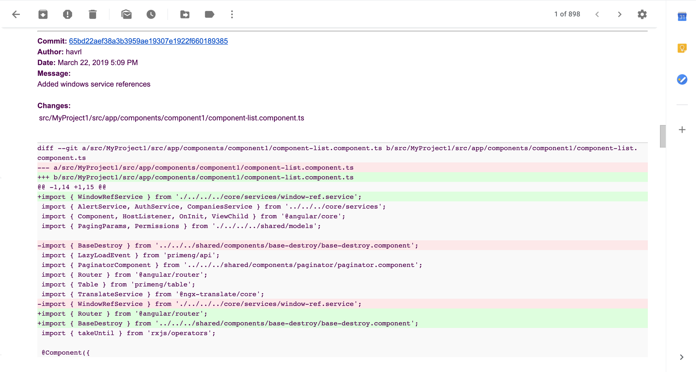

# Bitbucket-repo-watcher
A node.js application that checks periodically a bitbucket repository's the most recent commits for changes of specific files (paths) and send email notifications.

Example of received email:

## How it works

BitBucket-repo-watcher is using [BitBucket API v2](https://developer.atlassian.com/bitbucket/api/2/reference/) to browse a reporisoty and retrieve the most recent commits.

The application is making a pre-configured number of paginated requests, which return the collection of the most recent commits. Then it filters out the commits based on the Date / Author filters and checks the commit diffs for the changes of the target files. 
If any changes found then the summary of the corresponding commits is emailed.

BitBucket-repo-watcher can be run as a Windows Service using [WinSer](https://www.npmjs.com/package/winser) and configured to query Bitbucket repository periodically at the specific time using [Node Schedule](https://www.npmjs.com/package/node-schedule).

## How to install and run

1. `$ git clone git@github.com:Havrl/bitbucket-repo-watcher.git`
2. `$ cd bitbucket-repo-watcher`
3. `$ npm install`
4. Set the configuration file (see How to configure)
5. `$ npm run now`  (this will query the repo immediately and terminate)

## How to configure

1. Open bitbucket-repo-watcher folder in the IDE of your choice
2. Rename .env_example to .env
3. Replace the values with the real ones (see the Config Variables table below for details )

## How to install as a Windows service

1. Ensure the correct config is in place
2. `$ npm run install-win-service`
3. Run services.msc to open the Services Manager 
4. Start the `bitbucket-repo-watcher` service (this will keep the app running, which will query the repo at the specified date/time)

#### Note: 
The `bitbucket-repo-watcher` service is reporting the Windows events. Search The Windows Event Viewer for "nssm".

## How to configure email notifications with Gmail

1. Open the .env
2. Set `EMAIL_PROVIDER=gmail`
3. Set your Gmail account credentials to `EMAIL_USER` and `EMAIL_PASS` (note account should have 2-factor-auth / 2-step-verification disabled)
4. Set `EMAIL_FROM` (can be the same as EMAIL_USER) and `EMAIL_TO` (the email address to recieve notifications)

### Config Variables 

Variable | Description | Example
---|---|---
BITBUCKET_REPO_WEB_URL | Bitbucket repository url that can be accessed from the web browser. It will be used to create a link for commit details. | `BITBUCKET_REPO_WEB_URL=` `https://bitbucket.org/sergey-kosik/my-repository-name/`
BITBUCKET_REPO_API_URL | Bitbucket repository url, starting with BitBucket API v2 url `https://api.bitbucket.org/2.0/repositories/` | `BITBUCKET_REPO_API_URL=` `https://api.bitbucket.org/2.0/repositories/` `sergey-kosik/my-repository-name/`
BITBUCKET_REPO_DESC | Description of the repo will be used as an email's subject line. | `BITBUCKET_REPO_DESC=Bitbucket Repository Watcher`
BITBUCKET_USER BITBUCKET_PASS | User account credentials, used for Basic HTTP Authentication requests (note account should have 2-factor-auth / 2-step-verification disabled). | `BITBUCKET_USER=sergey-kosik` `BITBUCKET_PASS=pass$$ord`
COMMIT_PAGES | Number of total paginated requests (30 commits per page). | `COMMIT_PAGES=4`
EMAIL_PROVIDER | SMTP Email provider. See [Nodemailer](https://nodemailer.com) for the different providers. | `EMAIL_PROVIDER=gmail`
EMAIL_USER EMAIL_PASS | SMTP Email user account credentials | `EMAIL_USER=sergey.kosik@smtp.example.com` `EMAIL_PASS=pass$$word `
EMAIL_FROM | Email from. This can be the same as EMAIL_USER, in case of Gmail provider | `EMAIL_FROM=sergey.kosik@smtp.example.com`
EMAIL_TO | Recipient email address. | `EMAIL_TO=sergey.kosik@example.com`
COMMITS_FILTER_DATE | A target date for which commits to be checked. Can be either `TODAY` or a specific date in the form `YYYY-MM-DD`. If `TODAY` then only commits created today will be checked. In case of a specific date - only commits on the same date and after will be checked.  | To check today commits, set `COMMITS_FILTER_DATE=TODAY`. To check commits from specific date set  `COMMITS_FILTER_DATE=2019-01-23`
IGNORE_AUTHORS | If set, then the commits of those authors will be ignored. Can be used to filter out own commits. | To ignore my own commits where my name can be in two forms (as I might commit from two different machines) set `IGNORE_AUTHORS=Sergey Kosik,sergey.kosik`
IGNORE_BRANCHES | If set, then the commits for the specified branches will be ignored. | To ignore the commits for "master" and "default" branches set `IGNORE_BRANCHES=master,default`
IGNORE_MESSAGES | If set, then the commits with the specified messages will be ignored. | To ignore the commits with messages "Merge with master" and "Merge with default" set `IGNORE_MESSAGES=Merge with master,Merge with default`
SCHEDULE_DATE | The date of the scheduler recurrence, e.g. when the app will query the repo. The value should be a comma-separated RecurrenceRule properties: second (0-59) minute (0-59) hour (0-23) date (1-31) month (0-11) year dayOfWeek (0-6) Starting with Sunday (see [Node Schedule](https://www.npmjs.com/package/node-schedule) documentation) | To query the repo every day at 21.10 set `SCHEDULE_DATE=hour:21,minute:10`
WATCH_LIST | The comma-separated list of paths the app will check within the retrieved commits. The .env file is not able to handle multi-line variable, so the value should be in one line. | For example, to watch all files in one folder and only one file in the other folder, set  `WATCH_LIST=MyProject.Folder1,MyProject.Folder2/my-file1.js`

## TODO

* Add the configuration to install the app as a service on MacOS and Linux (this [link](https://stackoverflow.com/questions/4018154/how-do-i-run-a-node-js-app-as-a-background-service) provides a number of options)
